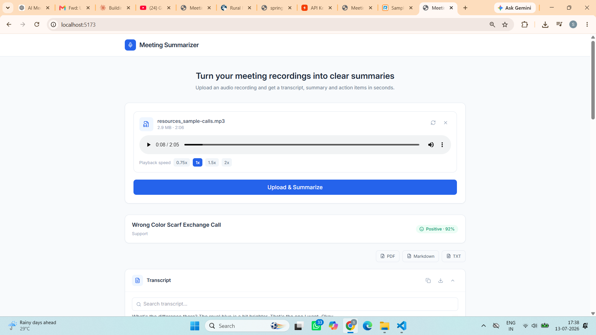
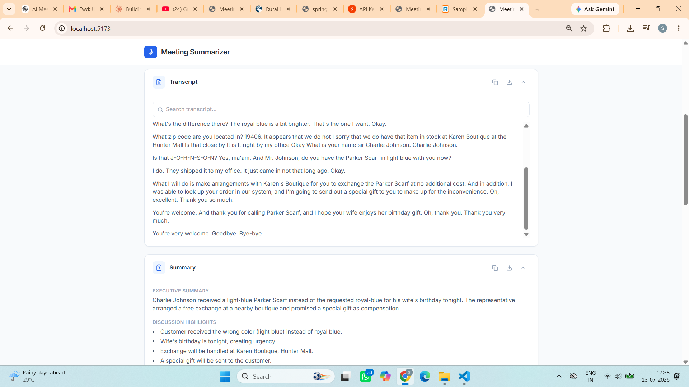
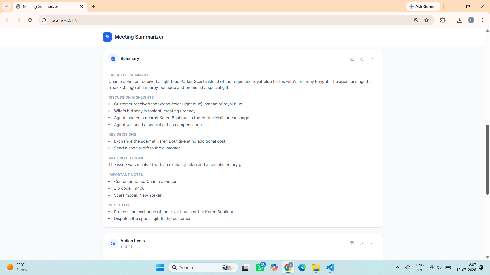
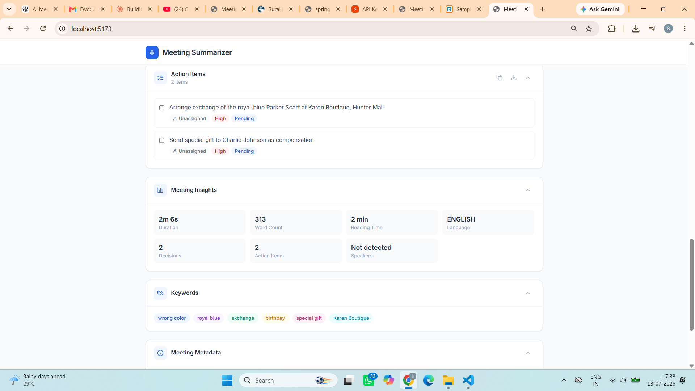
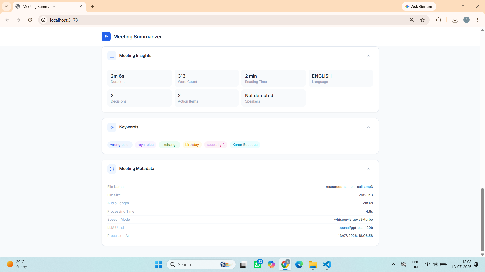

---

---

## Created By

**Shlok Kulkarni**

B.Tech in Information Technology  
Vishwakarma Institute of Information Technology (VIIT), Pune

GitHub: [https://github.com/<your-github-username> ](https://github.com/Shlok-Kulkarni-2005) 
LinkedIn: [https://www.linkedin.com/in/<your-linkedin-profile> *(Optional)*](https://www.linkedin.com/in/shlok-d-kulkarni/)

## AI Meeting Summarizer

An AI-powered web application that converts meeting audio recordings into structured transcripts, summaries, key decisions, and actionable tasks using Speech-to-Text and Large Language Models.

---

## Overview

The AI Meeting Summarizer is designed to simplify meeting documentation by automatically converting recorded conversations into organized meeting notes. Users can upload an audio file, and the application generates a transcript along with a structured summary, key decisions, action items, meeting insights, and downloadable reports.

---

## Features

- Audio upload with drag-and-drop support
- Speech-to-text transcription using Whisper
- AI-generated meeting summaries
- Key decision extraction
- Action item generation with owner, priority, and deadlines
- Suggested meeting title and category
- Sentiment analysis
- Keyword extraction
- Meeting insights and metadata
- Transcript search
- Copy to clipboard
- Export as PDF, Markdown, and TXT
- Responsive user interface

---

## Tech Stack

### Frontend
- React (Vite)
- Tailwind CSS
- Axios
- Lucide React
- jsPDF

### Backend
- Node.js
- Express.js
- Multer

### AI Services
- Groq API
- Whisper Large V3 Turbo
- GPT OSS 120B

---

## Project Structure

```
meeting-summarizer/
│
├── client/
│   ├── src/
│   ├── public/
│   └── package.json
│
├── server/
│   ├── controllers/
│   ├── routes/
│   ├── services/
│   ├── uploads/
│   ├── config/
│   └── package.json
│
└── README.md
```

---

## Installation

Clone the repository

```bash
git clone https://github.com/your-username/AI-Meeting-Summarizer.git
```

### Install Backend

```bash
cd server
npm install
```

### Install Frontend

```bash
cd ../client
npm install
```

---

## Environment Variables

Create a `.env` file inside the `server` folder.

```env
PORT=5000
GROQ_API_KEY=your_api_key
```

(Optional)

```env
VITE_API_BASE_URL=http://localhost:5000
```

---

## Running the Application

### Backend

```bash
cd server
npm run dev
```

### Frontend

```bash
cd client
npm run dev
```

Open:

```
http://localhost:5173
```

---

## Application Workflow

```
Upload Audio
      │
      ▼
Speech-to-Text
      │
      ▼
Transcript Generation
      │
      ▼
LLM Processing
      │
      ▼
Summary
Key Decisions
Action Items
Insights
      │
      ▼
Export Report
```

---

## API Endpoints

| Method | Endpoint | Description |
|---------|----------|-------------|
| POST | `/upload` | Upload meeting audio |
| POST | `/summarize` | Generate transcript and summary |

---

## Future Improvements

- Speaker diarization
- Support for longer audio recordings
- Cloud storage integration
- Calendar integration
- Multi-language support
- Real-time meeting transcription

---

## Screenshots

Add screenshots of:

- Upload Interface


- Transcription

- Generated Summary


- Action Items


- Meeting Insights


---

## License

This project is intended for educational and learning purposes.
